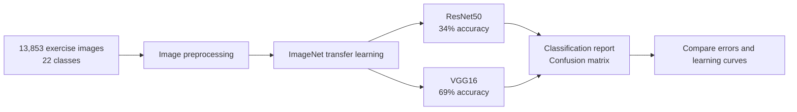

# CrossFit Exercise Image Classification with Transfer Learning

final project of a deep-learning project exploring automatic recognition of CrossFit movements from images. The report describes the Kaggle **Workout/Exercise Images** dataset as **13,853 images across 22 exercise classes**.

## Experiment

The report compares ImageNet-pretrained **ResNet50** and **VGG16** under the same setup: 10 training epochs with the pretrained base frozen. Both are evaluated with classification reports, confusion matrices, and learning curves.



| Model | Reported overall accuracy | Report observation |
|---|---:|---|
| ResNet50 | 34% | Weak overall performance; deadlift recall was 0.06 despite precision of 1.00 |
| VGG16 | 69% | Stronger result in this experiment; smoother learning curves and better separation |

The report selects VGG16 as the stronger candidate for this dataset and training configuration. These scores describe the reported experiment and should not be interpreted as production performance.

## Core competencies

- Computer vision and multiclass image classification
- Transfer learning with pretrained CNN architectures
- ResNet50/VGG16 comparison under a shared training setup
- Evaluation with accuracy, per-class precision/recall, confusion matrices, and learning curves
- Error analysis, generalization awareness, and responsible use of human movement images

## Tools and libraries

**Python**, **TensorFlow/Keras**, **KaggleHub**, **scikit-learn**, **NumPy**, **Matplotlib**, **Seaborn**.

## Repository code

`src/train_classifier.py` contains Python code cells exported from the project workflow notebook. Configure Kaggle access and dataset paths before running. The dataset and pretrained weights are downloaded separately and are not included.

## Setup

```bash
python -m pip install -r requirements.txt
```

## Limitations and responsible use

The report notes the need for additional training and validation, particularly for the more complex ResNet50 model. Exercise recognition can affect training decisions; the model should support, not replace, coach judgment. Images of people require appropriate consent and privacy safeguards.
